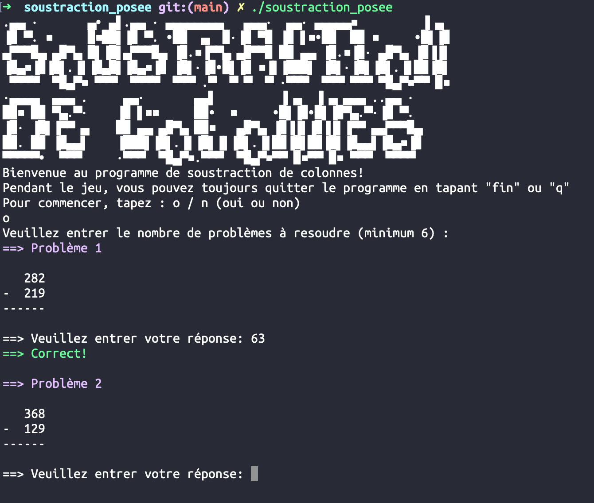

# soustraction_posee

Ce petit programme en c effectue des soustractions en colonnes et permet à l'utilisateur d'utiliser la méthode de regroupement pour résoudre les problèmes


Il s'agit d'un petit programme en C qui génère des problèmes de soustraction que l'utilisateur doit résoudre. Les problèmes sont présentés sous forme de colonnes et l'utilisateur est invité à saisir sa réponse. Le programme vérifie ensuite la réponse de l'utilisateur par rapport à la réponse correcte et fournit un retour d'information.



## Caractéristiques

- Generates 5 random subtraction problems with numbers ranging from 10 to 999.
- Checks the user's answer and provides immediate feedback.
- Keeps track of the total number of problems, correct answers, and incorrect answers.

## Comment lancer

```bash
make
./soustraction_posee
```

## Created

2021-04-10 16:00:00

## TODO

1. Add the **regroupment method** to the program (this is a method used to solve subtraction problems with larger numbers)
2. Add the **answer numbers reversal function**, so that when the user types the answer the program rearranges the numbers to match the correct answer.
3. (hardests)Add the ability to check the user's answer to the correct answer and to provide the explanation of the correct answer if the user's answer is incorrect.
4. Add the ability to **allow the user to select the number of problems to generate and solve**.
5. Include the **regrouping method** in the program (this is a method used to solve subtraction problems with larger numbers).
6. Code Comments: add more comments to the code to explain what each part of the code does. (final version)
7. Code Organization (REFACTORING) : reorganize code into more functions to improve readability and maintainability. For example, separate functions for generating a single problem, printing a problem, and checking the user's answer.
8. Magic Numbers: I have a few "magic numbers" in the code (like 5, the number of problems to generate). Need to these as constants at the top to make it easier to change them later (final version).
9. Make it so that at random the title of the program changes upon start (final version).

## Bugs

- _Number shifting_ :
    - _Explanation_ : If the bottom number is smaller than the top for example top is a 3 digit number and bottom is a 2 digit number, the way it prints out the problem is incorrect for solving it in a column format (the bottom number should be shifted to the right by the difference in the number of digits between the top and bottom numbers). for example 123 - 45 should be printed as:
    ```
       123
    -   45
    ------
    ```

- Error Handling: `GetUserAnswer` function assumes that the user will always enter a number. If the user enters a non-numeric value, `atoi` will return 0 and the program will continue. Add some error checking to handle this case.